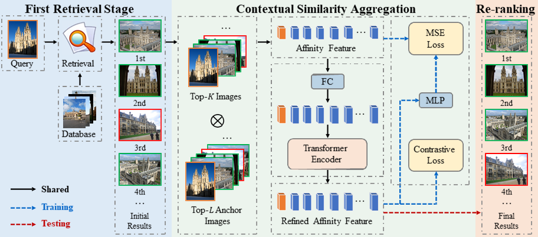
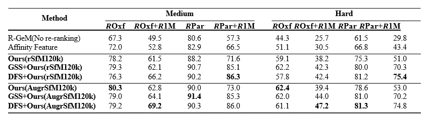

========

## Contextual Similarity Aggregation with Self-attention for Visual Re-ranking
Jianbo Ouyang, Hui Wu, et al.
NeurIPS 2021 [[arXiv](https://arxiv.org/abs/2110.13430)]

========

PyTorch training code for **CSA** (**C**ontextual **S**imilarity **A**ggregation).
We propose a visual re-ranking method by contextual similarity aggregation with transformer, obtaining **80.3 mAP** on ROxf with Medium evaluation protocols. Inference in 50 lines of PyTorch.



**What it is**. Unlike traditional visual reranking techniques, CSA uses the similarity between the image and the anchor image as a representation of the image, which is defined as affinity feature. It consists of a contrastive loss that forces the relevant images to have larger cosine similarity and vice versa, an MSE loss that preserves the information of the original affinity features, and a Transformer encoder architecture.
Given ranking list returned by the first-round retrieval, CSA first choose the top-L images in ranking list as the anchor images and calculates the affinity features of the top-K candidates,then dynamically refine the affinity features of different candiates in parallel. Due to this parallel nature, CSA is very fast and efficient.

**About the code**. 
Training code follows this idea - it is not a library,
but simply a [train.py](train.py) importing model and criterion
definitions with standard training loops.

# mAP performance of the proposed model
We provide results of baseline CSA and CSA trained with data augmentation.
mAP is computed with Medium and Hard evaluation protocols.
model will come soon.


# Requirements
- Python 3
- [PyTorch](https://pytorch.org/get-started/locally/) tested on 1.7.1+, torchvision 0.8.2+
- numpy
- matplotlib

# Usage - Visual Re-ranking
There are no extra compiled components in CSA and package dependencies are minimal,
so the code is very simple to use. We provide instructions how to install dependencies via conda.
Install PyTorch 1.7.1+ and torchvision 0.8.2+:
```
conda install -c pytorch pytorch torchvision
```

## Data preparation
Before going further, please check out [Filip Radenovic's great repository on image retrieval](https://github.com/filipradenovic/cnnimageretrieval-pytorch). We use his code and model to extract features for training images. If you use this code in your research, please also cite their work! [link to license](https://github.com/filipradenovic/cnnimageretrieval-pytorch/blob/master/LICENSE)

Download and extract rSfm120k train and val images with annotations from
[http://cmp.felk.cvut.cz/cnnimageretrieval/](http://cmp.felk.cvut.cz/cnnimageretrieval/).

Download [ROxf](http://www.robots.ox.ac.uk/~vgg/data/oxbuildings) and [RPar](http://www.robots.ox.ac.uk/~vgg/data/parisbuildings) datastes with [annotations](http://cmp.felk.cvut.cz/revisitop/).
Prepare features for testing and training images with Filip Radenovic's [model](http://cmp.felk.cvut.cz/cnnimageretrieval/data/networks/gl18/gl18-tl-resnet101-gem-w-a4d43db.pth) and [code](https://github.com/filipradenovic/cnnimageretrieval-pytorch).
We expect the directory structure to be the following:
```
path/to/data/
  ├─ annotations # annotation pkl files
  │   ├─ retrieval-SfM-120k.pkl
  │   ├─ roxford5k
  |   |   ├─ gnd_roxford5k.mat
  |   |   └─ gnd_roxford5k.pkl
  |   └─ rparis6k
  |   |   ├─ gnd_rparis6k.mat
  |   |   └─ gnd_rparis6k.pkl
  ├─ test # test features		
  |   ├─ r1m
  |   |   ├─ gl18-tl-resnet101-gem-w.pkl
  |   |   └─ rSfM120k-tl-resnet101-gem-w.pkl
  │   ├─ roxford5k
  |   |   ├─ gl18-tl-resnet101-gem-w.pkl
  |   |   └─ rSfM120k-tl-resnet101-gem-w.pkl
  |   └─ rparis6k
  |   |   ├─ gl18-tl-resnet101-gem-w.pkl
  |   |   └─ rSfM120k-tl-resnet101-gem-w.pkl
  └─ train # train features
      ├─ gl18-tl-resnet50-gem-w.pkl
      ├─ gl18-tl-resnet101-gem-w.pkl
      └─ gl18-tl-resnet152-gem-w.pkl
```

## Training
To train baseline CSA on a single node with 4 gpus for 100 epochs run:
```
sh experiment_rSfm120k.sh
```
A single epoch takes 10 minutes, so 100 epoch training
takes around 17 hours on a single machine with 4 2080Ti cards.
To ease reproduction of our results we provide
[results and training logs](log.txt)
for 200 epoch schedule (34 hours on a single machine).

We train CSA with SGD setting learning rate in the transformer to 0.1.
The transformer is trained with dropout of 0.1, and the whole model is trained with grad clip of 1.0.
To train CSA with data augmentation a single node with 4 gpus for 100 epochs run:
```
sh experiment_augrSfm120k.sh
```

## Evaluation
To evaluate CSA on Roxf and Rparis with a single GPU run:
```
sh test.sh
```
and get results as below 
```
>> Test Dataset: roxford5k *** fist-stage >>
>> gl18-tl-resnet101-gem-w: mAP Medium: 67.3, Hard: 44.24
>> gl18-tl-resnet101-gem-w: mP@k[1, 5, 10] Medium: [95.71 90.29 84.57], Hard: [87.14 69.71 59.86]

>> Test Dataset: roxford5k *** rerank-topk1024 >>
>> gl18-tl-resnet101-gem-w: mAP Medium: 77.92, Hard: 58.43
>> gl18-tl-resnet101-gem-w: mP@k[1, 5, 10] Medium: [94.29 93.14 89.71], Hard: [87.14 83.43 73.14]

>> Test Dataset: rparis6k *** fist-stage >>
>> gl18-tl-resnet101-gem-w: mAP Medium: 80.57, Hard: 61.46
>> gl18-tl-resnet101-gem-w: mP@k[1, 5, 10] Medium: [100.    98.    96.86], Hard: [97.14 93.14 90.57]

>> Test Dataset: rparis6k *** query-rerank-1024 >>
>> gl18-tl-resnet101-gem-w: mAP Medium: 87.2, Hard: 74.41
>> gl18-tl-resnet101-gem-w: mP@k[1, 5, 10] Medium: [100.    97.14  96.57], Hard: [95.71 92.86 90.14]
```

# Qualitative examples
Selected qualitative examples of our re-ranking method. Top-10 results are shown in the figure. The figure is divided into four groups which consist of a result of initial retrieval and a result of our re-ranking method. The first two groups are the successful cases and the other two groups arethe failed cases. The images on the left with orange bounding boxes are the queries. The image with green denotes the true positives and the red bounding boxes are false positives.


# License
CSA is released under the MIT license. Please see the [LICENSE](LICENSE) file for more information.

